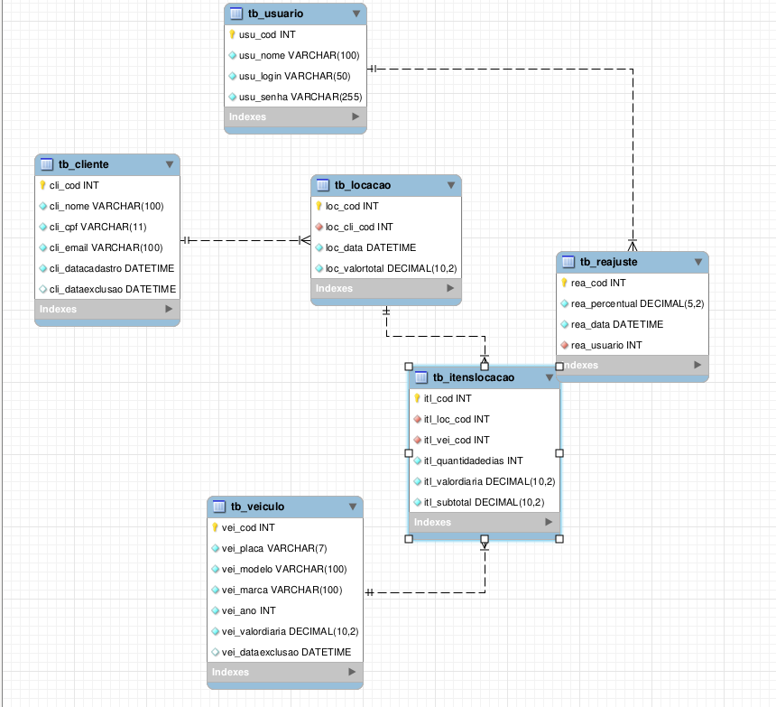

# 📌 API para um Sistema de Locadora de Veículos

Você foi contratado por uma empresa de desenvolvimento para criar uma **API interna de gerenciamento de uma locadora de veículos**.

Durante o desenvolvimento, você deverá implementar funcionalidades relacionadas ao cadastro de clientes, veículos, reajuste dos valores das diárias e geração das locações.

O sistema deverá utilizar **Node.js, Express, banco de dados relacional e autenticação JWT**.

---

## 🗂 Modelo Relacional

Considere o seguinte modelo conceitual para desenvolver a API:

### Tabelas principais

#### `tb_cliente`

| Campo              | Descrição               |
| ------------------ | ----------------------- |
| `cli_cod`          | Código do cliente       |
| `cli_nome`         | Nome completo           |
| `cli_cpf`          | CPF                     |
| `cli_email`        | E-mail                  |
| `cli_datacadastro` | Data de cadastro        |
| `cli_dataexclusao` | Data da exclusão lógica |

#### `tb_veiculo`

| Campo              | Descrição               |
| ------------------ | ----------------------- |
| `vei_cod`          | Código do veículo       |
| `vei_placa`        | Placa                   |
| `vei_modelo`       | Modelo                  |
| `vei_marca`        | Marca                   |
| `vei_ano`          | Ano                     |
| `vei_valordiaria`  | Valor da diária         |
| `vei_dataexclusao` | Data da exclusão lógica |

#### `tb_reajuste`

| Campo            | Descrição           |
| ---------------- | ------------------- |
| `rea_cod`        | Código do reajuste  |
| `rea_percentual` | Percentual aplicado |
| `rea_data`       | Data do reajuste    |
| `rea_usuario`    | Usuário responsável |

#### `tb_locacao`

| Campo            | Descrição              |
| ---------------- | ---------------------- |
| `loc_cod`        | Código da locação      |
| `loc_cli_cod`    | Cliente responsável    |
| `loc_data`       | Data da locação        |
| `loc_valortotal` | Valor total da locação |

#### `tb_itenslocacao`

| Campo                | Descrição                             |
| -------------------- | ------------------------------------- |
| `itl_cod`            | Código do item                        |
| `itl_loc_cod`        | Locação relacionada                   |
| `itl_vei_cod`        | Veículo alugado                       |
| `itl_quantidadedias` | Quantidade de dias                    |
| `itl_valordiaria`    | Valor da diária no momento da locação |
| `itl_subtotal`       | Subtotal do item                      |

#### `tb_usuario`

| Campo       | Descrição         |
| ----------- | ----------------- |
| `usu_cod`   | Código do usuário |
| `usu_nome`  | Nome              |
| `usu_login` | Login             |
| `usu_senha` | Senha             |

---



# 🚀 Funcionalidades

## 👤 Gerenciamento de Clientes

### Cadastro de clientes

Criar um endpoint para cadastrar novos clientes.

O endpoint deverá:

* Receber os dados do cliente;
* Inserir os dados na tabela `tb_cliente`;
* Gerar automaticamente a data de cadastro;
* Não exigir o preenchimento de `cli_dataexclusao`.

### Endpoint sugerido

```http
POST /clientes
```

### Exemplo de requisição

```json
{
    "nome": "João da Silva",
    "cpf": "12345678900",
    "email": "joao@email.com"
}
```

---

# 🗑 Exclusão lógica de clientes

O sistema **não deverá excluir fisicamente** o cliente do banco.

Ao solicitar a exclusão, deverá:

* Localizar o cliente pelo código;
* Atualizar `cli_dataexclusao`;
* Utilizar a data atual;
* Manter o registro no banco.

### Endpoint sugerido

```http
DELETE /clientes/:id
```

### Regra

Se o cliente já estiver excluído logicamente, a API deverá informar que o cliente não está ativo.

---

# 🚗 Gerenciamento de Veículos

Criar endpoints para:

* Cadastrar veículos;
* Consultar veículos;
* Alterar dados;
* Realizar exclusão lógica.

### Cadastro

```http
POST /veiculos
```

### Exemplo

```json
{
    "placa": "ABC1D23",
    "modelo": "Civic",
    "marca": "Honda",
    "ano": 2024,
    "valorDiaria": 180.00
}
```

### Regra importante

Veículos com `vei_dataexclusao` preenchido são considerados **inativos**.

Veículos inativos não podem ser utilizados em novas locações.

---

# 💰 Reajuste dos valores das diárias

A empresa deseja possuir uma funcionalidade para reajustar o valor da diária de **todos os veículos ativos**.

O reajuste será informado através de um percentual.

### Exemplo

Valor atual:

```text
R$ 150,00
```

Percentual:

```text
10%
```

Novo valor:

```text
R$ 165,00
```

### Regra matemática

```text
novo_valor = valor_atual + (valor_atual * percentual / 100)
```

### Endpoint sugerido

```http
PUT /veiculos/reajuste
```

### Exemplo

```json
{
    "percentual": 10
}
```

---

## 📋 Registro do reajuste

Sempre que um reajuste for realizado, deverá ser criado um registro em `tb_reajuste`.

O registro deverá armazenar:

* Percentual aplicado;
* Data do reajuste;
* Usuário responsável.

### Atenção

O reajuste deverá ser aplicado **somente aos veículos ativos**.

Veículos que possuem `vei_dataexclusao` preenchido não devem sofrer alteração.

---

# 📄 Geração de Locação

A locadora precisa registrar as locações realizadas pelos clientes.

Uma locação poderá possuir **um ou mais veículos**.

A operação deverá utilizar:

```text
tb_locacao
        |
        | 1:N
        ↓
tb_itenslocacao
        |
        | N:1
        ↓
tb_veiculo
```

---

## 🧾 Geração da locação

Criar um endpoint:

```http
POST /locacoes
```

O endpoint deverá receber:

* Código do cliente;
* Lista de veículos;
* Quantidade de dias de cada veículo.

### Exemplo

```json
{
    "cliente": 10,
    "itens": [
        {
            "veiculo": 3,
            "dias": 5
        },
        {
            "veiculo": 7,
            "dias": 2
        }
    ]
}
```

---

# 💵 Cálculo do valor

O valor de cada item deverá ser calculado através de:

```text
subtotal = quantidade_de_dias × valor_da_diaria
```

O valor total da locação será:

```text
valor_total = soma dos subtotais
```

### Exemplo

Veículo 1:

```text
5 dias × R$ 100 = R$ 500
```

Veículo 2:

```text
2 dias × R$ 150 = R$ 300
```

Valor total:

```text
R$ 800
```

---

# ⚠️ Valor histórico da diária

Um ponto importante do sistema é que o valor da diária utilizado na locação deverá ser armazenado em `tb_itenslocacao`.

Por exemplo:

```text
Valor atual do veículo: R$ 200
```

O cliente realiza uma locação:

```text
3 dias × R$ 200 = R$ 600
```

Posteriormente, a empresa aplica um reajuste:

```text
R$ 200 → R$ 250
```

A locação antiga deverá continuar registrando:

```text
Valor da diária = R$ 200
```

e não R$ 250.

---

# 🔄 Transação no banco de dados

A geração da locação deverá utilizar uma **transação**.

A operação envolve:

1. Inserção da locação;
2. Inserção dos itens da locação;
3. Cálculo do subtotal;
4. Cálculo do valor total;
5. Atualização da locação com o valor total.

Caso qualquer uma dessas operações apresente erro:

```text
ROLLBACK
```

Caso todas sejam executadas corretamente:

```text
COMMIT
```

### Objetivo

Evitar situações como:

```text
Locação criada
↓
Erro ao inserir item
↓
Banco possui uma locação incompleta
```

---

# 🔐 Autenticação JWT

O sistema deverá possuir autenticação utilizando **JWT**.

A autenticação deverá utilizar a tabela:

```text
tb_usuario
```

---

## 🔑 Login

Criar um endpoint:

```http
POST /login
```

O usuário deverá enviar:

```json
{
    "login": "admin",
    "senha": "123456"
}
```

Caso os dados estejam corretos, a API deverá gerar um token JWT.

---

# 🎫 Token JWT

O token deverá possuir:

* Identificação do usuário;
* Data de expiração;
* Assinatura utilizando uma chave secreta.

O token deverá expirar após:

```text
5 horas
```

---

# 🛡 Middleware de autenticação

Criar um middleware responsável por:

1. Recuperar o token enviado pelo cliente;
2. Verificar se o token existe;
3. Validar o JWT;
4. Verificar se o token não está expirado;
5. Permitir ou bloquear a requisição.

O token deverá ser enviado no header:

```http
Authorization: Bearer TOKEN
```

---

# 🔒 Proteção das rotas

Todas as rotas deverão exigir autenticação JWT.

A única exceção será:

```http
POST /login
```

Exemplo:

```text
POST /login
        ↓
      público

POST /clientes
        ↓
      JWT

DELETE /clientes/:id
        ↓
      JWT

POST /veiculos
        ↓
      JWT

PUT /veiculos/reajuste
        ↓
      JWT

POST /locacoes
        ↓
      JWT
```

---

# 📌 Regras importantes

### Clientes

* Clientes excluídos logicamente não devem aparecer nas consultas de clientes ativos.
* Clientes excluídos não podem realizar novas locações.

### Veículos

* Veículos excluídos logicamente não podem ser alugados.
* Veículos excluídos não participam do reajuste salarial.
* Veículos excluídos devem permanecer no banco de dados.

### Reajustes

* O reajuste deve ser aplicado somente aos veículos ativos.
* Todo reajuste deve possuir um registro em `tb_reajuste`.
* O usuário responsável deve ser identificado através do JWT.

### Locações

* O cliente precisa estar ativo.
* O veículo precisa estar ativo.
* O valor da diária deve ser armazenado no momento da locação.
* O valor total deve ser calculado pela API.
* A criação da locação deve utilizar transação.

### JWT

* Todas as rotas, exceto `/login`, devem exigir autenticação.
* O token deve possuir validade de 5 horas.
* Tokens inválidos ou expirados devem impedir o acesso.

---

# 📋 Resumo das funcionalidades

* [ ] Cadastro de clientes
* [ ] Consulta de clientes
* [ ] Exclusão lógica de clientes
* [ ] Cadastro de veículos
* [ ] Consulta de veículos
* [ ] Exclusão lógica de veículos
* [ ] Reajuste percentual das diárias
* [ ] Registro dos reajustes
* [ ] Cadastro de locações
* [ ] Cadastro dos itens da locação
* [ ] Cálculo de subtotais
* [ ] Cálculo do valor total
* [ ] Utilização de transação
* [ ] Login
* [ ] Geração de JWT
* [ ] Middleware de autenticação
* [ ] Expiração do token em 5 horas

---

# 🧠 Desafio extra

Para aumentar a dificuldade do exercício, implemente também:

### 1. Consulta de locações

```http
GET /locacoes
```

Retornar:

* Código da locação;
* Nome do cliente;
* Data;
* Valor total.

### 2. Consulta detalhada

```http
GET /locacoes/:id
```

Retornar a locação junto com seus itens.

### 3. Filtro

Criar uma consulta que permita buscar somente:

```text
Locações de determinado cliente
```

ou

```text
Locações realizadas em determinado período
```

### 4. Validações

Impedir:

* CPF duplicado;
* E-mail duplicado;
* Placa duplicada;
* Valores negativos;
* Quantidade de dias menor ou igual a zero;
* Percentual de reajuste negativo.

---

# 🎯 O que você deve conseguir demonstrar na prova

Ao terminar esse exercício, você deverá saber implementar:

```text
Express
   ↓
Rotas
   ↓
Controllers
   ↓
Repositories
   ↓
Banco de dados
```

Além de compreender:

```text
CRUD
│
├── INSERT
├── SELECT
├── UPDATE
└── DELETE lógico

JWT
│
├── Login
├── Geração do token
├── Middleware
└── Validação

Banco
│
├── JOIN
├── INSERT relacionado
├── UPDATE em massa
└── Transação
     ├── BEGIN
     ├── COMMIT
     └── ROLLBACK
```

O objetivo é conseguir desenvolver a API **sem consultar a resolução do exercício original**, utilizando apenas os requisitos acima.

